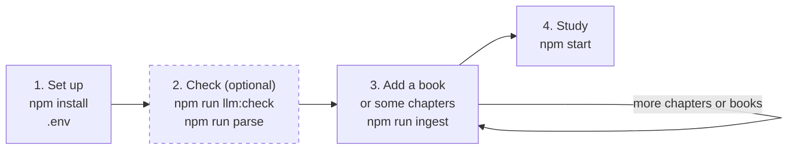

# Tutor

A personal tutor that teaches from your own books. You make a theme of study, for example "SQL", and add books to it. The tutor finds the concepts in the books and checks which concepts you know. Then it teaches the other concepts one at a time, with references to the books, and tests each one.

The tutor runs on your computer. It uses one large language model (LLM) from Anthropic, OpenAI, or OpenRouter. You select the model.

## How it works

You use the tutor in four steps. Steps 1 to 3 are commands in the terminal. Step 4 is the app in the browser.



1. [Set up the tutor](#step-1-set-up-the-tutor). Do this one time.
2. [Check the model and the book](#step-2-check-the-model-and-the-book-optional). This step is optional. It saves no data.
3. [Add a book to a theme](#step-3-add-a-book-to-a-theme). Add the full book, or only the chapters that you want to study now. This is the only step that puts books into the tutor.
4. [Study in the browser](#step-4-study-in-the-browser). Start the app and learn. The app shows you the way.

## The commands at a glance

| Command | Use | Uses the model | What it writes |
|---|---|---|---|
| `npm run llm:check` | Optional. After a change to `.env`. | Yes, 3 small requests. | Nothing. |
| `npm run parse -- <book>` | Optional. Prints a report of the chapters in the terminal. Use it to check a book and to find the chapter numbers for `--chapters`. | No. | `data/parse/<book>/`, for you to read. No other command reads these files. |
| `npm run ingest -- <theme> <book> --chapters <list> --preview` | Recommended. Check the concepts of some chapters before you save them. | Yes. | Preview files in the folder of the book. The database does not change, so the app does not show the chapters. |
| `npm run ingest -- <theme> <book> --chapters <list>` | To study a selection of chapters (or a single one). You need this run or the full run below. | Yes. | The folder of the book and the database. The app shows the concepts of these chapters. |
| `npm run ingest -- <theme> <book>` | To study all the chapters of a book. | Yes. | The folder of the book and the database. |
| `npm start` | Each time that you want to study. | Yes, for the tests and the lessons. | Your progress in the database. |
| `npm run refresh -- <theme> <book>` | Only after an update of the tutor that changes the parser. | Only for new images. | The section files of the book. |

The folder of the book is `data/themes/<theme>/books/<book>/`. The database is `data/tutor.db`.

## Common questions

- **Must I run `parse` before `ingest`?** No. Ingest parses the book by itself. The `parse` command only prints a report in the terminal, at no cost. See [Check a book](#check-a-book).
- **How do I find the number of a chapter for `--chapters`?** Run `npm run parse` and read the `#` column. This number can be different from the number in the title of the chapter.
- **Must I ingest the full book?** No. With `--chapters`, you can study a book one part at a time. Later, you can add more chapters.
- **Does `ingest` always save to the database?** Yes. Only `--preview` keeps the database as it is. With `--chapters`, the app shows the concepts of these chapters, and you can study them at once.
- **Do I pay two times for the chapters of a preview?** No. The tutor keeps the model results of each run, so a later run does not pay for these chapters again.
- **How do I add more chapters later?** Run `ingest` again with `--replace`, for the full book or for a longer chapter list. See [Add more chapters later](#add-more-chapters-later).
- **Can I move or delete the book file after ingest?** Yes. Ingest keeps a copy of the book file in the folder of the book.
- **How do I add a second book to a theme?** Run `npm run ingest` again with the same theme name. The tutor adds the concepts of the new book to the concept map of the theme.
- **How do I make a new theme?** Run `npm run ingest` with a new theme name. The first book makes the theme.
- **Can I delete `data/parse/`?** Yes. Nothing else uses it.

## Requirements

- Node.js 22 or later.
- An API key for one provider: Anthropic, OpenAI, or OpenRouter.

## Step 1: Set up the tutor

1. Install the packages:

   ```
   npm install
   ```

2. Copy the example settings file:

   ```
   cp .env.example .env
   ```

3. In `.env`, set the provider, the model, the reasoning level, and the API key. For OpenRouter, you can also select the providers that serve the model. The file explains each value. The tutor has no default model.

## Step 2: Check the model and the book (optional)

These two commands are checks. They save nothing that the tutor uses later. You can skip them.

### Check the model

```
npm run llm:check
```

The command sends one JSON request, one text request with references, and one request with an image. If a value in `.env` is missing or not valid, the command tells you which value to change.

If the model does not accept images, the command tells you. Then the tutor keeps the images of your books as placeholders, and all other parts work.

### Check a book

```
npm run parse -- /path/to/book.epub
```

This command reads the book and prints a report in the terminal. It does not use the model, so it costs nothing. The command has two uses:

- Find a problem in a book before you pay for ingest.
- Find the chapter numbers for `ingest --chapters`.

The report looks like this example:

```
My SQL Book (Jane Doe)
Table of contents: outline

  #  Kind      Sections    Words   Kept  Terms  Title
  1  chapter          4    1,105   100%      7  Overview
  2  chapter         55   14,094   101%    193  Chapter 1: SQL Basics
  3  chapter         25    2,384   100%     44  Chapter 2: Joins
  4  chapter         13    1,993    72%      7  Chapter 3: Queries
 ...

Total: 40 chapters, 272 sections, 50,063 words.

Not taught:
  front     Table of Contents (4,128 words)

Checklist: bold 567, emphasis 15. Glossary entries: 0. Index entries: 0.

Warnings: 1
  [unread_images] 94 images in the chapters have no text, so the sections keep only their alternative text. Ingest and refresh read these images with the model.

Output: data/parse/my-sql-book
Report: data/parse/my-sql-book/parse-report.json
```

The table has one row for each chapter:

| Column | What it shows |
|---|---|
| `#` | The number of the chapter in the tutor. Use this number with `ingest --chapters`. |
| Kind | `chapter` or `appendix`. |
| Sections | The number of sections in the chapter. A section is the text under one heading. The lessons refer to sections. |
| Words | The number of words that the tutor keeps from the chapter. |
| Kept | The kept words as a percentage of the words in the book file. A value much lower than 100% means lost text. |
| Terms | The number of bold and italic terms in the chapter. Ingest makes sure that the concepts cover these terms. |
| Title | The title of the chapter. |

The number in the `#` column can be different from the number in the title. In the example, "Chapter 1: SQL Basics" has the number 2, because "Overview" is chapter 1. To ingest "Chapter 1: SQL Basics", use `--chapters 2`.

Make sure that the report is correct:

- The chapter list must match the table of contents of the book.
- Each value in the "Kept" column must be close to 100%. In the example, chapter 4 lost text.
- The "Not taught" list must contain only front and back matter, for example the preface. Ingest does not teach these parts.
- The warnings at the end show other problems.

The command also writes files to `data/parse/<book>/`. Open them in a text editor to read the text that the tutor will teach from:

- `sections/`: one Markdown file for each section, for example `02-01-sql-basics.md`.
- `parse-report.json`: the chapters, the sections, the page numbers, the checklist terms, and the warnings.

No other command reads these files. To write them to a different folder, add `--out <folder>`.

## Step 3: Add a book to a theme

A theme is an area of study, for example "SQL". The `ingest` command puts a book into a theme. If the theme does not exist, the command makes it.

### What ingest does

1. It parses the book with the same parser as `npm run parse`.
2. It keeps a copy of the book file, and writes one Markdown file for each section.
3. The model reads each image of the book one time. Code becomes a code block, a table becomes a Markdown table, and other images get a short description.
4. The model finds the concepts in each chapter. Then it adds them to the concept map of the theme, in modules.
5. It saves the theme, the book, the sections, and the concepts to the database. A preview skips this part.

The command shows the number of model requests and asks before it starts. The requests cost money.

### Ingest a book

You can ingest the full book at one time, or a book one part at a time.

1. Make a preview of one or two chapters:

   ```
   npm run ingest -- SQL /path/to/book.pdf --chapters 2 --preview
   ```

2. Read the concept map of the preview in `data/themes/<theme>/books/<book>/concept-map.preview.md`. If the concepts look correct, continue.

3. Ingest the chapters that you want to study now:

   ```
   npm run ingest -- SQL /path/to/book.pdf --chapters 1-3
   ```

   Or ingest the full book:

   ```
   npm run ingest -- SQL /path/to/book.pdf
   ```

   The app shows the concepts of the chapters that you ingested. The chapters of the preview come from the cache, so they cost nothing again. The concept map of the theme goes to `data/themes/<theme>/concept-map.md`.

### Add more chapters later

After a run with `--chapters`, the theme has the book. A new run of the same book then needs `--replace`.

- To add all the other chapters, ingest the full book with `--replace`.
- To add only some chapters, use `--chapters` with `--replace`. Put the chapters that you saved before into the list too.

If the list does not contain a chapter that you saved before, its concepts lose their sources. The tutor deletes the concepts that you did not start.

The chapters that you saved before come from the cache, so they cost nothing again. Your concepts and their progress stay. But the book gets new sections, so the references of your old lessons break. To get a lesson with good references, open the lesson and click "Teach it again".

### The files of a book

Ingest writes these files to `data/themes/<theme>/books/<book>/`:

- The copy of the book file.
- `sections/`: one Markdown file for each section. The lessons read the book text from these files.
- `work/`: the cached model results. `work/images.json` keeps the image texts, so each image costs one request only one time.
- `concept-map.preview.md` and `ingest-report.preview.json`: the results of a run with `--preview`. The report lists the sections without a concept, the checklist items with the mark "minor", and the quotes that are not in the text.
- `ingest-report.json`: the report of a run without `--preview`.

### Ingest options

- `--chapters <list>`: ingest only these chapters, for example `1-3` or `2,5`. Use it to study a book one part at a time. To add more chapters later, see [Add more chapters later](#add-more-chapters-later).
- `--preview`: do not change the database. The command writes the concept map and the report as preview files. Use it with `--chapters` to check the concepts of some chapters before you save them.
- `--yes`: start without the question.
- `--fresh`: ignore the cached chapter results. The cached image texts stay.
- `--replace`: ingest a book again that the theme has already. The book gets new sections, so the references of your old lessons break. To update the text of a book and keep your progress, use `npm run refresh`.

"Add book" in the app comes later. For now, add books from the terminal.

## Step 4: Study in the browser

1. Start the app:

   ```
   npm start
   ```

2. Open http://localhost:3000 in a browser.

The command builds the app and starts the server. The server listens only on your computer. To stop it, press Ctrl+C in the terminal.

In the app, you open a theme and go through these stages:

- Choose: on the concept map, test, learn, or skip each concept. To do this for many concepts in one step, select their checkboxes and use the bar at the bottom of the page.
- Diagnosis: the tutor asks 2 questions about each concept that you selected for a test. To start it, click "Test it" next to a concept, or select concepts and click "Test them".
- Study queue: the concepts to learn, in an order that you can change.
- Lesson and test: the tutor teaches one concept from your books, with references. Then it tests the concept with the questions that fit it: one question for a simple concept, at most 5 for a larger one. To pass, answer each question correctly. A pass makes the concept mastered.
- Review board: a list of all concepts with their status and their stars.

The diagnosis, the lessons, the questions about a lesson, and the tests use the model in `.env`. The model writes the questions and grades the open answers. If you think that a grade is wrong, use "Dispute the grade". A disputed answer counts as correct.

The terminal shows one line for each model call: the time, the finish reason, the token counts, and the provider behind OpenRouter. These lines show the steps that wait for the model. A high reasoning level makes each call slower.

## Update a book after a tutor update

You need this command only after an update of the tutor that changes the parser. An example is a fix for code blocks or for lost text. The command gives a book that you ingested before the new parse, and it keeps your progress:

```
npm run refresh -- SQL my-sql-book
```

The second value is the folder name of the book in `data/themes/<theme>/books/`, or the title of the book. The command parses the copy of the book again with the current parser. The model reads the images that are not in the cache, but only in the chapters with concepts. The command then shows the number of images and asks before it starts. The images of the other chapters keep their placeholders. When you ingest one of these chapters later, the `ingest` command reads its images.

The command writes only the section files and the word counts of the sections. Your concepts, statuses, queue, stars, lessons, and test answers do not change. If a section of the new parse does not match the database, the command stops and changes no section. The cause is a parser change that splits the book into different sections. Then only `ingest --replace` can update the book.

Your old lessons do not change. At the end, the command lists the concepts with a lesson from the old text. To get a lesson from the new text, open the lesson and click "Teach it again".

## Development commands

| Command | What it does |
|---|---|
| `npm run dev:server` and `npm run dev:app` | Run the server and the app with live reload. Use two terminals. |
| `npm test` | Run the tests. The tests do not call the model. |
| `npm run typecheck` | Check the TypeScript types. |

## Books

- EPUB files work best. The parser reads the publisher CSS for headings, bold, and italic.
- PDF files must be tagged. Word and many publishing tools make tagged PDF files. The parser stops with a clear message for an untagged or a scanned PDF.
- Some books show code or tables as images. Ingest uses the model to read them. If the model does not accept images, the images stay as placeholders.

## Status

Phase 1 and phase 2 are complete. All the steps above work now. "Add book" in the app comes later. See `PLAN.md` for the build order and `DESIGN-v3.md` for the design.

## Project layout

```
src/
  cli/          command-line scripts
  config.ts     reads .env
  db/           SQLite schema
  ingest/
    core/       blocks, sections, Markdown, checklist (all formats)
    epub/       EPUB reader
    pdf/        tagged PDF reader
    stages/     extract, review, and merge (the model stages)
  llm/          model client for Anthropic, OpenAI, and OpenRouter
  server/       HTTP API
  app/          browser app (React)
test/           tests and test books
data/           your books, the results, and the database (not in git)
```

## Privacy and copyright

- Do not commit `data/` or `.env`. Git ignores them.
- The `data/` folder contains the text of books that you bought.
- When the tutor sends a request, it sends book text to the provider that you selected. With OpenRouter, the text goes to the vendor of the selected model.
