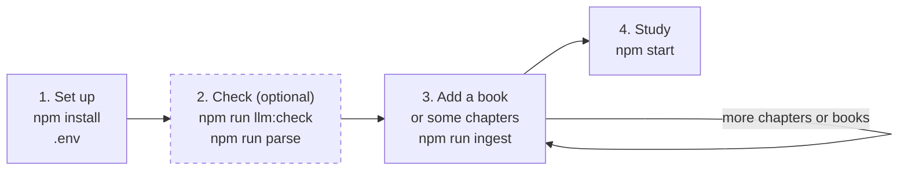

#  Tutor

> See also my other project, [Tapas Habit & Goal Tracker](https://tapastracker.app), a full-featured habit tracker for iPhone and Android. Also, **I am available for hire.** Contact me on [LinkedIn](https://www.linkedin.com/in/demetrius-edelin/).

A personal tutor that teaches from your own books. You make a subject of study, for example "SQL", and add books to it. The tutor finds the concepts in the books and checks which concepts you know. Then it teaches the other concepts one at a time, with references to the books, and tests each one.

The tutor runs on your computer. It uses one large language model (LLM) from Anthropic, OpenAI, or OpenRouter. You select the model.

## Why not a simple chat with your books?

A chat with a book answers the questions that you think of. The tutor turns your books into a course:

- **Structure.** The tutor puts the concepts of a subject into modules on a concept map. It teaches them one at a time, from a study queue.
- **All the concepts.** Ingest finds the concepts in each chapter. Then it makes sure that the concepts cover the bold and italic terms of the book.
- **Visible progress.** The concept map and the review board show the status of each concept, for example known, learning, or mastered.
- **Your control.** You select the concepts to test, to learn, and to skip. You also set the order of the study queue. The tutor only suggests.

## Quick start

You need Node.js 22 or later and an API key for Anthropic, OpenAI, or OpenRouter. We test the tutor on macOS.

```sh
git clone https://github.com/demetrius-edelin/tutor.git
cd tutor
npm install
cp .env.example .env                       # then set the provider, the model, and the API key
npm run llm:check                          # optional: send 3 small test requests to the model
npm run ingest -- SQL /path/to/book.epub   # add a book to the subject "SQL"
npm start                                  # then open http://localhost:3000
```

In the Windows command prompt, use `copy` instead of `cp`.

The `ingest` command shows the number of model requests and asks before it starts. To start with some chapters of the book only, see [Step 3 of the usage guide](docs/usage.md#step-3-add-a-book-to-a-subject).

## How it works

You use the tutor in four steps. Steps 1 to 3 are commands in the terminal. Step 4 is the app in the browser.



1. [Set up the tutor](docs/usage.md#step-1-set-up-the-tutor). Do this one time.
2. [Check the model and the book](docs/usage.md#step-2-check-the-model-and-the-book-optional). This step is optional. It saves no data.
3. [Add a book to a subject](docs/usage.md#step-3-add-a-book-to-a-subject). Add the full book, or only the chapters that you want to study now. Only this step puts books into the tutor.
4. [Study in the browser](docs/usage.md#step-4-study-in-the-browser). Start the app and learn. The app shows the next action at each stage.

The [usage guide](docs/usage.md) explains each step and each command.

### In the app

In the app, you open a subject and go through these stages:

- Choose: on the concept map, test, learn, or skip each concept. To do this for many concepts in one step, select their checkboxes and use the bar at the bottom of the page.
- Diagnosis: the tutor asks 2 questions about each concept that you selected for a test. To start it, click "Test it" next to a concept, or select concepts and click "Test them".
- Study queue: the concepts to learn, in an order that you can change.
- Lesson and test: the tutor teaches one concept from your books, with references. Then it tests the concept with the questions that fit it: one question for a simple concept, at most 5 for a larger one. To pass, answer each question correctly. A pass makes the concept mastered.
- Review board: a list of all concepts with their status and their stars.

The model writes the questions and grades the open answers. If you think that a grade is wrong, use "Dispute the grade". A disputed answer counts as correct.

## Commands

| Command | Use | Uses the model | What it writes |
|---|---|---|---|
| `npm run llm:check` | Optional. After a change to `.env`. | Yes, 3 small requests. | Nothing. |
| `npm run parse -- <book>` | Optional. To check a book and to find the chapter numbers for `--chapters`. | No. | A report in `data/parse/<book>/`, for you to read. |
| `npm run ingest -- <subject> <book> --chapters <list> --preview` | Recommended. To check the concepts of some chapters before you save them. | Yes. | Preview files in the folder of the book. The database does not change. |
| `npm run ingest -- <subject> <book> --chapters <list>` | To study some chapters of a book. | Yes. | The folder of the book and the database. |
| `npm run ingest -- <subject> <book>` | To study all the chapters of a book. | Yes. | The folder of the book and the database. |
| `npm start` | Each time that you want to study. | Yes, for the diagnosis, the lessons, and the tests. | Your progress in the database. |
| `npm run refresh -- <subject> <book>` | Only after an update of the tutor that changes the parser. | Only for new images. | The section files of the book. |

The folder of the book is `data/subjects/<subject>/books/<book>/`. The database is `data/tutor.db`.

## Configuration

The tutor reads its configuration from the `.env` file. Copy `.env.example` to `.env`. The file explains each value.

| Variable | Value |
|---|---|
| `LLM_PROVIDER` | `anthropic`, `openai`, or `openrouter`. |
| `LLM_MODEL` | The model name, exactly as the provider writes it. For OpenRouter, use the form `vendor/model`. |
| `LLM_REASONING` | Optional. `none`, `minimal`, `low`, `medium`, `high`, `xhigh`, or `max`. Empty means the default of the model. |
| `OPENROUTER_PROVIDERS` | Optional, for OpenRouter only. The providers that can serve the model, in order. |
| `ANTHROPIC_API_KEY`, `OPENAI_API_KEY`, `OPENROUTER_API_KEY` | The API key of the selected provider. |

The tutor has no default model. After a change to `.env`, run `npm run llm:check`.

### Which model to use

We tested the tutor with different models. GPT-6 Luna from OpenAI, at the reasoning level `high`, gave the best results. It was also the cheapest model in our tests, and it is very smart for a model in its price range.

```
LLM_PROVIDER=openai
LLM_MODEL=gpt-6-luna
LLM_REASONING=high
```

### Cost

The tutor uses your API key, so your provider charges you for each request.

- Ingest makes the most requests, because the model reads each chapter and each image of the book. The command shows the number of requests and asks before it starts.
- The tutor keeps the model results of each chapter and each image in a cache. A later run does not pay again for the chapters in the cache.
- In the app, the diagnosis, the lessons, the questions about a lesson, and the tests use the model.
- A high reasoning level makes each request slower.

### Port

The app uses port 3000. To use a different port, set `PORT` in the shell. The tutor does not read `PORT` from `.env`.

```
PORT=8080 npm start
```

## Books

- EPUB files work best. The parser reads the publisher CSS for headings, bold, and italic.
- PDF files must be tagged. Word and many publishing tools make tagged PDF files. The parser stops with a clear message for an untagged or a scanned PDF.
- Some books show code or tables as images. Ingest uses the model to read them. If the model does not accept images, the images stay as placeholders.

## Common questions

- **Must I run `parse` before `ingest`?** No. Ingest parses the book by itself. The `parse` command only prints a report in the terminal, at no cost. See [Check a book](docs/usage.md#check-a-book).
- **How do I find the number of a chapter for `--chapters`?** Run `npm run parse` and read the `#` column. This number can be different from the number in the title of the chapter.
- **Must I ingest the full book?** No. With `--chapters`, you can study a book one part at a time. Later, you can add more chapters.
- **Does `ingest` always save to the database?** Yes. Only `--preview` keeps the database as it is. With `--chapters`, the app shows the concepts of these chapters immediately.
- **Do I pay two times for the chapters of a preview?** No. The tutor keeps the model results of each run, so a later run does not pay for these chapters again.
- **How do I add more chapters later?** Run `ingest` again with `--replace`, for the full book or for a longer chapter list. See [Add more chapters later](docs/usage.md#add-more-chapters-later).
- **Can I move or delete the book file after ingest?** Yes. Ingest keeps a copy of the book file in the folder of the book.
- **How do I add a second book to a subject?** Run `npm run ingest` again with the same subject name. The tutor adds the concepts of the new book to the concept map of the subject.
- **How do I make a new subject?** Run `npm run ingest` with a new subject name. The first book makes the subject.
- **Can I delete `data/parse/`?** Yes. Nothing else uses it.

## Status and roadmap

The tutor is at version 0.1.0. All the commands and app stages in this README and in the usage guide work. The tutor is for one person on one computer.

Planned:

- Add a book from the app, with the progress of the ingest. Now you add books with a command in the terminal.
- A container image, to run the tutor on your own server.

## Development

| Command | What it does |
|---|---|
| `npm run dev:server` and `npm run dev:app` | Run the server and the app with live reload. Use two terminals. |
| `npm test` | Run the tests. The tests use a fake model client, so they do not call a model. |
| `npm run test:watch` | Run the tests again after each change. |
| `npm run typecheck` | Check the TypeScript types of the server and of the app. |

### Tech stack

| Part | Tools |
|---|---|
| Language | TypeScript on Node.js 22. |
| Server | Fastify. |
| App | React 19 and Vite. |
| Database | SQLite, with better-sqlite3. |
| Book parser | JSZip and cheerio for EPUB, pdf.js for PDF, and Turndown for Markdown. |
| Model clients | The Anthropic SDK and the OpenAI SDK. OpenRouter uses the OpenAI SDK. |
| Tests | Vitest. |

### Project layout

```
src/
  cli/          command-line scripts
  config.ts     reads .env
  db/           SQLite schema
  ingest/
    core/       blocks, sections, Markdown, checklist (all formats)
    epub/       EPUB reader
    pdf/        tagged PDF reader
    stages/     extract, review, and merge (the model stages)
  llm/          model client for Anthropic, OpenAI, and OpenRouter
  tutor/        diagnosis, lessons, questions, grader, and study queue
  server/       HTTP API
  app/          browser app (React)
docs/           usage guide
test/           tests, a fake model client, and a builder for test EPUB files
data/           your books, the results, and the database (not in git)
```

## AI assistance

I built Tutor with Claude Code. All the product and design decisions are mine, and I tested each milestone carefully with real books. Claude wrote the code and most of the documentation.

## Contributing

Pull requests are welcome. For a large change, open an issue first, so that we can agree on the approach.

Before you send a pull request, do these steps:

1. Run `npm test`. All tests must pass.
2. Run `npm run typecheck`. It must show no errors.

## Privacy and copyright

- Do not commit `data/` or `.env`. Git ignores them.
- The `data/` folder contains the text of books that you bought.
- The repository contains no book text. The tests build their own small EPUB file in code.
- When the tutor sends a request, it sends book text to the provider that you selected. With OpenRouter, the text goes to the vendor of the selected model.

## License

[MIT](LICENSE)
